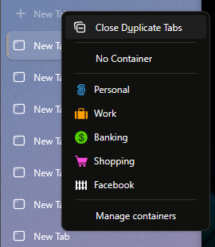

# Close duplicate tabs for Zen browser

Adds a "Close Duplicate Tabs" menu item to the 'new tab' button's context menu(s), visible either by right clicking or long pressing it. This mirrors Firefox's feature to close all duplicate tabs across the browser, unlike [Zen](https://zen-browser.app/ "Zen Browser"), which (as far as i know) only lets you close duplicates of a single tab via right-click, and haven't made the 'All tabs' menu available which in Firefox this action would reside in.

It uses, and is dependent on [fx-autoconfig](https://github.com/MrOtherGuy/fx-autoconfig).

There is also a keyboard shortcut for closing duplicate tabs, currently set to <kbd>⌃ Control</kbd> + <kbd>⇧ Shift</kbd> + <kbd>U</kbd>. The shortcut can easily be changed to something else by changing the `key` and `modifier` of the [object](https://github.com/olavhaug1/zen-close-duplicate-tabs/blob/8834ebf1cfc63b3a5d4d63cd480a7884a6d1aeab/JS/duplicateTabsButton.uc.mjs#L66) that is sent to `UC_API.Hotkeys.define()`.

```js
    // Keyboard shortcut
    const shortcut = {
        id: "closeDuplicateTabs",
        key: "U",
        modifiers: "ctrl shift",
        ...

    UC_API.Hotkeys.define(shortcut)...
```

## How to use and install

### Prerequisites

* Set up userChrome (involves changing settings in _about:config_ and creating a _'chrome'_ folder in the active browser profile). A guide on how to set up userChrome (that might be outdated): [Customizing the Firefox UI with CSS](https://www.reddit.com/r/firefox/wiki/userchrome/)
* Install fx-autoconfig and follow the install steps

### Install

* Copy the folders _CSS_, _JS_ and _resources_ to the browsers chrome folder inside the active or preferred profile
  * On Windows it's typically located here: _"%AppData%\zen\Profiles\\`{some-name}`.Default\chrome"_
* Restart the browser
  * One might have to _"Clear startup cache"_ via about:support if the menu item doesn't show up

## Preview



## Bugs / room for improvement

- After 1.8.1b:
    - Success notification doesn't always show up, and the placement is a bit weird
    - Long press menu isn't populated
- Check compatibilty with other layouts than the standard (left-side vertical, single, expanded toolbar)
- Support/populate menu(s) for new tab-widget
